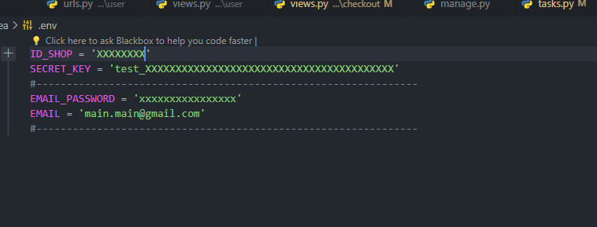

# https://mistea.ru/

# Сервис по оформлению подписок на чай, написаный на Django

Это проект сервиса подписок, разработанный на Django.
Чтобы развернуть проект для общего доступа используйте ngrok_runner.py в папке mistea проекта

# Установка

1. Клонируйте репозиторий

```
https://github.com/setusq/Mistea_project.git

```

Если вы не используете Git, то вы можете просто скачать исходный код репозитория в ZIP-архиве и распаковать его на свой компьютер.

2. Создайте виртуальное окружение и активируйте его

```
python -m venv venv
source venv/bin/activate
```

3. Установите зависимости

```
pip install -r requirements.txt
```

4. Создайте в корне проекта .env. Пример наполнения env для проекта:

   
5. Запустите миграции и загрузите данные в БД

```
python manage.py migrate
```

6. Создайте администратора

```
python manage.py createsuperuser
```

7. Запустите сервер

```
python manage.py runserver
```

Откройте браузер и перейдите по адресу http://127.0.0.1:8000/admin/. Введите имя пользователя и пароль администратора, чтобы войти в панель управления

# Готово!

Вы успешно установили проект на Django и готовы начать его использовать!


# Авторы

[tsukerin](https://github.com/tsukerin)

[setusq](https://github.com/setusq)
